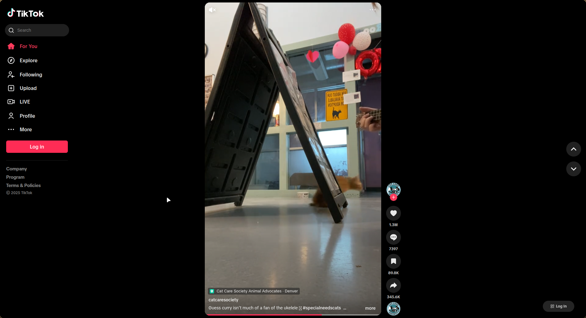

<p align="center">
  
</p>

<h1 align="center">TikTok Desktop</h1>

<p align="center">
  <a href="https://aur.archlinux.org/packages/tiktok-desktop/"></a>
  <a href="https://github.com/rhythmcreative/tiktok/releases"></a>
  <a href="#license"></a>
  <a href="https://github.com/rhythmcreative/tiktok/releases"></a>
</p>

<p align="center">
  An open source TikTok desktop application for all platforms to use.
  I created this because in waydroid i cant use tiktok so I created tiktok for linux 🔥🔥✅
</p>

## 📋 Table of Contents

- [🚀 Project Overview](#-project-overview)
- [✨ Features](#-features)
- [📥 Installation](#-installation)
- [🔧 Usage](#-usage)
- [👥 Contributing](#-contributing)
- [📄 License](#-license)
- [👤 Author](#-author)

## 🚀 Project Overview

TikTok Desktop is an open-source, cross-platform application that brings the TikTok experience to your desktop. Built with performance and user experience in mind, it offers a clean interface for browsing TikTok content, creating videos, and interacting with the TikTok community without the limitations of a mobile device.

## ✨ Features

- For Linux
- Native desktop integration
- Enhanced video viewing experience on larger screens
- Video creation tools with desktop advantages
- Advanced filters and effects
- Content management dashboard
- Keyboard shortcuts for efficient navigation
- Notification system for likes, comments, and follows
- Dark mode and customizable interface

## 📥 Installation

### For linux

You can install TikTok Desktop from the AUR for Arch/Manjaro distributions:

```bash
git clone repository
cd tiktok
chmod +x install.sh
sudo ./install.sh
```


## 🔧 Usage

After installation, launch the application from your application menu or desktop shortcut.

U launch it on the terminal via putting ##tiktok

## 🛰️ Screenshots



# This image its just for reference nothing more

## 👥 Contributing

Contributions are welcome! if you want


## 📄 License

This project is licensed under the MIT License - see the LICENSE file for details.

## 👤 Author

- **Rhythm Creative** - Project Creator and Maintainer
