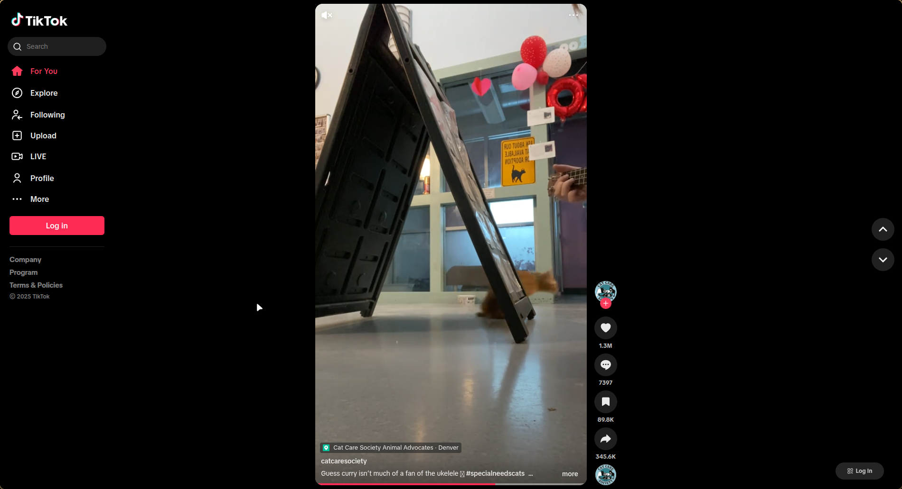

<h1 align="center">TikTok for Linux</h1>

<div align="center">

[](https://archlinux.org/)
[](https://www.debian.org/)
[](https://fedoraproject.org/)
</div>

<div align="center">
 <p><i>An open source Tiktok desktop app for linux, this was created because on Waydroid I can't use tiktok so i created this.</i></p>
</div>

[](https://git.io/typing-svg)

To install, clone the repository and run the `install.sh` script:

```bash
git clone https://github.com/rhythmcreative/tiktok.git
cd tiktok
chmod +x install.sh
./install.sh
```

> [!IMPORTANT]
> **Run the script as a normal user**. The script will use `sudo` automatically only when it needs to install system packages. **Do not run it with `sudo ./install.sh`** as it might cause permission issues with your local configuration. 


After installation, you can launch the application in several ways:
1. **Application menu:** Search for "TikTok" in your apps.
2. **Desktop shortcut:** Click the TikTok icon on your desktop.
3. **Terminal:** Just type `tiktok`.

[](https://git.io/typing-svg)

To remove the application and all its components (icon, menu entry, terminal alias, and local data) use this script:

```bash
chmod +x uninstall.sh
./uninstall.sh
```

[](https://git.io/typing-svg)




